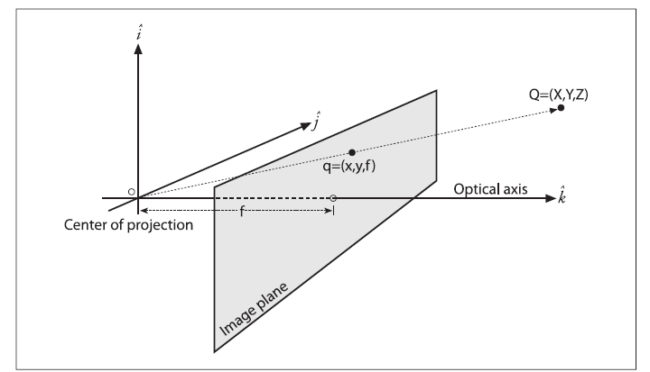

# Visión por Computadora: De Píxeles a Entendimiento 🤖👁️

¡Bienvenido/a a este curso de Visión por Computadora\! En este repositorio encontrarás una serie de tutoriales diseñados para llevarte desde los conceptos más básicos hasta técnicas más avanzadas, todo explicado de una manera sencilla y práctica para que cualquiera pueda empezar a "enseñar a ver" a las máquinas.

El objetivo es desmitificar el campo de la CV y darte las herramientas para que puedas crear tus propios proyectos.

-----

## Índice del Curso

1.  **Fundamentos Esenciales**
      * ¿Qué es una imagen para una computadora? (Píxeles, Canales, Resolución)
2.  **Procesamiento de Imágenes**
      * **Calibración de Cámara: Corrigiendo la Visión del Mundo**
      * Operaciones con Píxeles: Brillo, Contraste y Colores
      * Filtros y Convoluciones: Suavizado, Detección de Bordes y Enfoque
3.  **Análisis y Detección**
      * Segmentación de Imágenes: Encontrando lo que nos interesa
      * Detección y Seguimiento de Objetos
4.  **Deep Learning Aplicado a Visión**
      * Introducción a las Redes Neuronales Convolucionales (CNNs)
      * Clasificación de Imágenes
      * Detección de Objetos con Modelos Pre-entrenados (YOLO, SSD)

-----

## Calibración de Cámara: Corrigiendo la Visión del Mundo 📸📏

Empezamos con la calibración porque es un paso fundamental y a menudo subestimado. Antes de poder medir o analizar una escena, debemos asegurarnos de que la cámara nos está dando una imagen geométricamente correcta.

Calibrar una cámara es como **"graduarle la vista"**. Por la forma de sus lentes, las cámaras distorsionan la realidad. Lo que en el mundo real es una línea recta, en la imagen puede aparecer como una línea ligeramente curva. La calibración nos permite encontrar un modelo matemático para corregir estas imperfecciones.

Antes de poder medir distancias, reconstruir una escena en 3D o interactuar con el mundo, una cámara necesita entender su propia geometría. Calibrar una cámara es el proceso de descubrir sus características internas para traducir los píxeles de una imagen a mediciones fiables del mundo real.

### El Modelo Matemático: Puntos, Píxeles y Matrices

Para corregir las imperfecciones, primero necesitamos un modelo matemático que describa cómo una cámara ideal debería funcionar.

#### El Modelo Pinhole Ideal

El modelo más simple y fundamental es el de la **cámara estenopeica (pinhole)**. Imagina una caja con un pequeño orificio en un lado y una película fotográfica en el lado opuesto. Los rayos de luz de un objeto en el mundo pasan a través del orificio y se proyectan de forma invertida en la película.

Para simplificar las matemáticas, solemos usar un modelo virtual donde el plano de la imagen se coloca *delante* del orificio (que llamamos **centro de proyección**). De esta forma, la imagen no aparece invertida. La relación clave, por semejanza de triángulos, es:

$$x = f \cdot \frac{X}{Z} \quad , \quad y = f \cdot \frac{Y}{Z}$$

Donde:

  * $(X, Y, Z)$ son las coordenadas de un punto 3D en el mundo real.
  * $(x, y)$ son las coordenadas del punto proyectado en el plano de la imagen.
  * $f$ es la **distancia focal** de la cámara.

<figure>
  
  <figcaption> Q es el punto (X,Y,Z) en el mundo real, q es el punto (x,y) en el plano de la imagen y $f$ es la distancia focal.</figcaption>
</figure>

