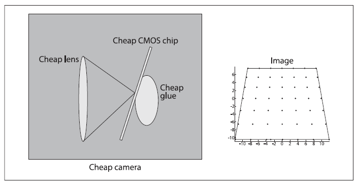
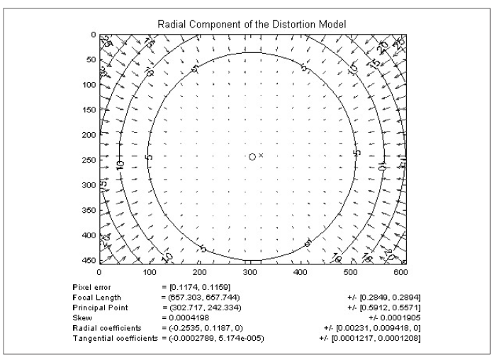
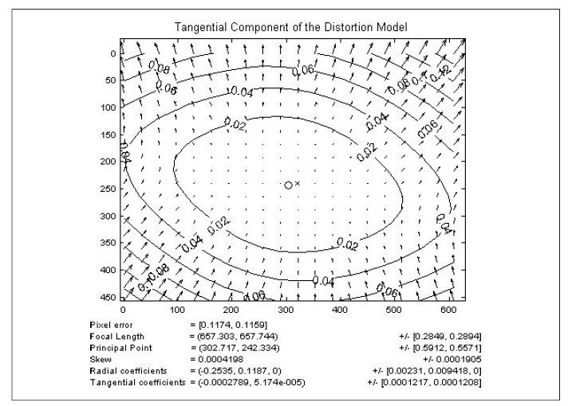
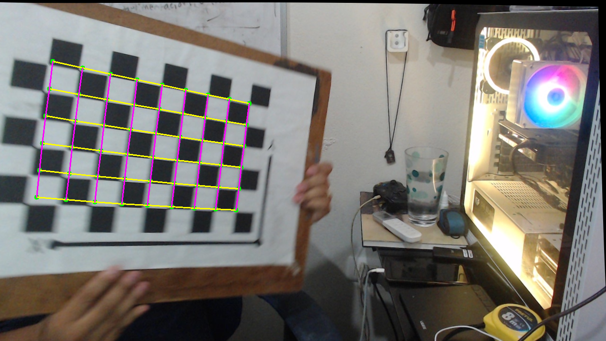

# Visión por Computadora: De Píxeles a Entendimiento 🤖👁️

¡Bienvenidos a este curso de Visión por Computadora\! En este repositorio encontrarás una serie de tutoriales diseñados para llevarte desde los conceptos más básicos hasta técnicas más avanzadas, todo explicado de una manera sencilla y práctica para que cualquiera pueda empezar a "enseñar a ver" a las máquinas.

El objetivo es desmitificar el campo de la CV y darte las herramientas para que puedas crear tus propios proyectos.

-----

-----

## Calibración de Cámara: Corrigiendo la Visión del Mundo 📸📏

Empezamos con la calibración porque es un paso fundamental y a menudo subestimado. Antes de poder medir o analizar una escena, debemos asegurarnos de que la cámara nos está dando una imagen geométricamente correcta.

Calibrar una cámara es como **"graduarle la vista"**. Por la forma de sus lentes, las cámaras distorsionan la realidad ver Figura 1. Lo que en el mundo real es una línea recta, en la imagen puede aparecer como una línea ligeramente curva. La calibración nos permite encontrar un modelo matemático para corregir estas imperfecciones.

Antes de poder medir distancias, reconstruir una escena en 3D o interactuar con el mundo, una cámara necesita entender su propia geometría. Calibrar una cámara es el proceso de descubrir sus características internas para traducir los píxeles de una imagen a mediciones fiables del mundo real.

<figure>
  
  <figcaption> Fig.1 Ejemplos de distorsiones del lente. </figcaption>
</figure>

### El Modelo Matemático: Puntos, Píxeles y Matrices

Para corregir las imperfecciones, primero necesitamos un modelo matemático que describa cómo una cámara ideal debería funcionar.

#### El Modelo Pinhole Ideal

El modelo más simple y fundamental es el de la **cámara estenopeica (pinhole)**. Imagina una caja con un pequeño orificio en un lado y una película fotográfica en el lado opuesto. Los rayos de luz de un objeto en el mundo pasan a través del orificio y se proyectan de forma invertida en la película.

Para simplificar las matemáticas, solemos usar un modelo virtual donde el plano de la imagen se coloca *delante* del orificio (que llamamos **centro de proyección**). De esta forma, la imagen no aparece invertida. La relación clave, por semejanza de triángulos, es:

$$x = f \cdot \frac{X}{Z} \quad , \quad y = f \cdot \frac{Y}{Z}$$

Donde:

  * $(X, Y, Z)$ son las coordenadas de un punto 3D en el mundo real.
  * $(x, y)$ son las coordenadas del punto proyectado en el plano de la imagen.
  * $f$ es la **distancia focal** de la cámara. ver figura 2.

<figure>
  
  <figcaption> Fig.2 Q es el punto (X,Y,Z) en el mundo real, q es el punto (x,y) en el plano de la imagen y f es la distancia focal.</figcaption>
</figure>

#### Coordenadas Homogéneas y la Matriz Intrínseca (K)

Podemos expresar esta proyección de forma matricial usando **coordenadas homogéneas**, que añaden una dimensión extra para simplificar las transformaciones proyectivas. Esto nos permite encapsular las propiedades internas de la cámara en una única matriz 3x3 llamada **matriz de parámetros intrínsecos (K)**.

$$\begin{pmatrix} 
x_{pixel} \\
y_{pixel} \\ 
1 \end{pmatrix} = \begin{pmatrix} 
f_x & 0 & c_x \\
0 & f_y & c_y \\ 
0 & 0 & 1 \end{pmatrix} 
\begin{pmatrix} X_{cam} \\
Y_{cam} \\ 
Z_{cam} 
\end{pmatrix}$$

  * **$f\_x, f\_y$ (Distancia Focal en píxeles):** El "zoom" de la lente, pero medido en unidades de píxeles en los ejes X e Y. Es la combinación de la distancia focal física y el tamaño de los píxeles en el sensor.
  * **$c\_x, c\_y$ (Punto Principal):** El verdadero centro óptico de la imagen. Es el punto en píxeles donde el eje óptico de la lente intersecta el sensor. Rara vez coincide con el centro exacto de la imagen.

Antes de continuar vamos a explicar más a detalle que son las coordenadas homogéneas.

Son una maniobra matemática que nos permite simplificar las operaciones geométricas, como las traslaciones, rotaciones y cambios de escala, representándolas todas como una única operación: la multiplicación de matrices.

## ¿Cual es el problema de las coordenadas cartesianas?

En un sistema de coordenadas cartesianas normal (el que usamos habitualmente con ejes X, Y, Z), algunas operaciones geométricas son más complicadas que otras.

* Una **rotación** se puede expresar como una multiplicación de matrices.
* Un **cambio de escala** (escalado) también se puede expresar como una multiplicación de matrices.
* Una **traslación** (mover un objeto sin rotarlo) se expresa como una **suma** de vectores.

Este "problema" de tener que combinar sumas y multiplicaciones es inconveniente para las computadoras, especialmente para el hardware gráfico (GPUs) que está optimizado para realizar multiplicaciones de matrices de forma masiva y muy rápida.

## ¿Cuál es la solución?: Añadir una dimensión extra

Las coordenadas homogéneas resuelven este problema añadiendo una dimensión extra a nuestros puntos, tradicionalmente llamada **w**.

* Un punto **2D** $(X, Y)$ se convierte en $(x, y, w)$.
* Un punto **3D** $(X, Y, Z)$ se convierte en $(x, y, z, w)$.

Para convertir de coordenadas cartesianas a homogéneas, simplemente añadimos un 1 en la nueva coordenada `w`:

* $(X, Y) \rightarrow (X, Y, 1)$
* $(X, Y, Z) \rightarrow (X, Y, Z, 1)$

Para convertir de vuelta de homogéneas a cartesianas, dividimos todas las coordenadas por `w` y descartamos la última componente:

* $(x, y, w) \rightarrow (x/w, y/w)$
* $(x, y, z, w) \rightarrow (x/w, y/w, z/w)$

### ¿Por qué funciona esto?

Al añadir esta dimensión extra, todas las transformaciones geométricas (incluida la traslación) se pueden expresar como una única multiplicación de matrices.

**Ejemplo: Traslación en 2D**

Imagina que quieres mover el punto $(X, Y)$ una distancia de $(T_x, T_y)$.

* **En coordenadas cartesianas:** $(X_{nuevo}, Y_{nuevo}) = (X + T_x, Y + T_y)$ (una suma).
* **En coordenadas homogéneas:** Representamos la traslación con una matriz y el punto como un vector. La operación se convierte en una multiplicación.

$$\begin{pmatrix} 
1 & 0 & T_x \\ 
0 & 1 & T_y \\
0 & 0 & 1 
\end{pmatrix} \begin{pmatrix}
X \\
Y \\
1 
\end{pmatrix} = \begin{pmatrix} 
X + T_x \\
Y + T_y \\
1 
\end{pmatrix}$$


El resultado, $(X + T_x, Y + T_y, 1)$, es el nuevo punto en coordenadas homogéneas. Al convertirlo de vuelta a cartesianas, obtenemos $(X + T_x, Y + T_y)$, que es exactamente el resultado que queríamos.

### El Punto en el Infinito

Una propiedad interesante de las coordenadas homogéneas es que nos permiten representar el concepto de "puntos en el infinito". Si el valor de `w` es 0, al intentar convertir de vuelta a coordenadas cartesianas, tendríamos que dividir por cero.

$$(x, y, 0) \rightarrow (\infty, \infty)$$

Esto es muy útil en gráficos por computadora y visión por computadora para representar la dirección de los rayos de luz o líneas paralelas que "se encuentran" en el infinito.

En resumen, las coordenadas homogéneas son un sistema que, **al añadir una dimensión `w`**, nos permite **unificar todas las transformaciones geométricas en una sola operación de multiplicación de matrices**, lo cual es computacionalmente muy eficiente.

Ahora si continuemos con el proceso de calibración.

#### Parámetros Extrínsecos (R y T)

La matriz intrínseca traduce puntos desde el sistema de coordenadas 3D *de la cámara* a la imagen 2D. Pero, ¿dónde está la cámara en el mundo? Los **parámetros extrínsecos** describen su posición y orientación en el espacio. Consisten en:

  * Una **matriz de rotación (R)** de 3x3 que define la orientación de la cámara.
  * Un **vector de traslación (T)** de 3x1 que define su posición.

Juntos, nos permiten transformar un punto del mundo real $(X\_w, Y\_w, Z\_w)$ al sistema de coordenadas de la cámara $(X\_c, Y\_c, Z\_c)$.

#### Distorsiones del Lente

Aquí es donde abandonamos el mundo ideal. Las lentes reales, especialmente las más económicas ver Figura 3, no son perfectas e introducen distorsiones. Las principales son:

<figure>
  
  <figcaption> Fig.3 Ejemplo de como son las lentes económicas. </figcaption>
</figure>

1.  **Distorsión Radial:** Ocurre porque la lente curva más los rayos de luz en los bordes que en el centro. Esto causa el famoso efecto "ojo de pez" o de "barril". Se modela con una serie de coeficientes $(k\_1, k\_2, k\_3)$.

<figure>
  
  <figcaption> Fig.4 Ejemplo de distorsión radial.</figcaption>
</figure>

2.  **Distorsión Tangencial:** Ocurre si la lente no está perfectamente paralela al sensor de la cámara. Se modela con dos coeficientes $(p\_1, p\_2)$.

<figure>
  
  <figcaption> Fig.5 Ejemplo de distorsión tangencial.</figcaption>
</figure>

El objetivo final de la calibración es encontrar los valores precisos de la **matriz intrínseca (K)** y los **cinco coeficientes de distorsión $(k\_1, k\_2, k\_3, p\_1, p\_2)$**.

### El Proceso Práctico con un Tablero de Ajedrez ♟️

Para encontrar todos estos parámetros, necesitamos un objeto cuya geometría conozcamos a la perfección. Un **tablero de ajedrez** es ideal porque es plano y sus esquinas internas forman una cuadrícula perfectamente regular.

El proceso consiste en mostrarle a la cámara el tablero desde múltiples ángulos y distancias. OpenCV utiliza estas múltiples vistas para resolver el sistema de ecuaciones y encontrar los parámetros de la cámara.

### Tutorial Práctico en Código

Aquí está el flujo completo para calibrar tu cámara.

#### Paso 1: Preparación del Entorno

Instala la paqueteria necesaria para calibrar la cámara.
```bash
pip install opencv-python numpy 
```
```bash
pip install matplotlib
```
#### Paso 2: Recolectar las Imágenes del Tablero

1.  Imprime un patrón de tablero de ajedrez. Aqui puedes descargar un ejemplo. [Aqui.](checkerboardPattern.pdf)
2.  Toma entre 15-20 fotos del tablero desde diferentes ángulos. Asegúrate de que el tablero llene diferentes partes de la vista de la cámara.
3.  Guarda todas las imágenes en una carpeta.

#### Paso 3: Código de Adquisición automática

Visualiza el código de adquisición. [ver adquisicion2D.py](adquisicion2D.py)

* El siguiente código busca y controla la cámara conectada a la computadora.
* Despliega la imagen de video
* Busca el tablero (Hay que establecer correctamente las columnas y filas del tablero para que lo detecte)
* Mueve el tablero y empieza a capturar las imagenes y guardarlas. (Calibralo con los milimetros de movimiento entre mas alto los milimetros menor sensibilidad en el movimiento)
* Presiona "q" y finaliza.

```python
import cv2
import numpy as np
import os
import time

# --- 1. CONFIGURACIÓN DEL TABLERO ---
# Número de esquinas INTERIORES del tablero (ej: un tablero 10x7 tiene 9x6 esquinas interiores)
CHESSBOARD_SIZE = (9, 6) # (columnas, filas)

# Criterios para la detección y refinamiento de esquinas
criteria = (cv2.TERM_CRITERIA_EPS + cv2.TERM_CRITERIA_MAX_ITER, 30, 0.001)

# --- 2. CONFIGURACIÓN PARA DETECCIÓN DE MOVIMIENTO Y ADQUISICIÓN ---
# Umbral de movimiento: Si el vector de traslación (tvec) cambia en más de este valor (mm), se considera movimiento.
# Ajusta este valor según qué tan sensible quieres que sea la detección de movimiento.
# Un valor más pequeño detectará movimientos sutiles.
MOVEMENT_THRESHOLD_MM = 1 # 10 mm = 1 cm de cambio en la posición
MIN_TIME_BETWEEN_CAPTURES_SEC = 1.0 # Mínimo tiempo en segundos entre capturas automáticas

# --- 3. CONFIGURAR LA ADQUISICIÓN DE VIDEO ---
cap = cv2.VideoCapture(0) # '0' para la cámara predeterminada (tu Logitech C922)

if not cap.isOpened():
    print("Error: No se pudo abrir la cámara. Asegúrate de que esté conectada y no en uso.")
    exit()

# Establecer resolución (opcional, tu C922 soporta varias)
cap.set(cv2.CAP_PROP_FRAME_WIDTH, 1280) # Ejemplo de resolución
cap.set(cv2.CAP_PROP_FRAME_HEIGHT, 720) # Ejemplo de resolución
print(f"Resolución actual de la cámara: {int(cap.get(cv2.CAP_PROP_FRAME_WIDTH))}x{int(cap.get(cv2.CAP_PROP_FRAME_HEIGHT))}")


# --- 4. CONFIGURAR CARPETA DE SALIDA ---
output_dir = "imagenes_para_calibracion_auto"
os.makedirs(output_dir, exist_ok=True)
print(f"Las imágenes se guardarán en: {os.path.abspath(output_dir)}")

# --- 5. PREPARAR PUNTOS DEL OBJETO 3D PARA solvePnP (solo para estimar pose y detectar movimiento) ---
# No necesitamos SQUARE_SIZE_MM preciso para esto, solo una escala relativa. Usaremos 1.0.
objp_for_pose = np.zeros((CHESSBOARD_SIZE[0] * CHESSBOARD_SIZE[1], 3), np.float32)
objp_for_pose[:, :2] = np.mgrid[0:CHESSBOARD_SIZE[0], 0:CHESSBOARD_SIZE[1]].T.reshape(-1, 2) * 1.0

# Una matriz de cámara de identidad y distorsión cero para solvePnP si no tenemos calibración.
# Esto nos dará una estimación de pose relativa, suficiente para detectar movimiento.
# ¡IMPORTANTE! Estos NO son los parámetros de calibración reales.
dummy_mtx = np.eye(3, dtype=np.float32)
dummy_mtx[0,0] = dummy_mtx[1,1] = 800 # Valores iniciales estimados para una lente
dummy_mtx[0,2] = cap.get(cv2.CAP_PROP_FRAME_WIDTH) / 2
dummy_mtx[1,2] = cap.get(cv2.CAP_PROP_FRAME_HEIGHT) / 2
dummy_dist = np.zeros((4,1), dtype=np.float32)


# --- 6. VARIABLES DE ESTADO ---
image_count = 0
last_tvec = None # Almacena la traslación del frame anterior
last_capture_time = time.time() # Último momento en que se guardó una imagen

# --- 7. BUCLE PRINCIPAL DE ADQUISICIÓN ---
print("\nInstrucciones:")
print("  - Mueve el tablero de ajedrez frente a la cámara.")
print("  - Las imágenes se guardarán automáticamente cuando se detecte un movimiento significativo.")
print("  - Presiona 'q' para salir en cualquier momento.")

while(True):
    ret, frame = cap.read() # Captura un frame
    if not ret:
        print("Error al leer el frame. ¿La cámara sigue conectada?")
        break

    gray = cv2.cvtColor(frame, cv2.COLOR_BGR2GRAY)
    display_frame = frame.copy() # Hacemos una copia para dibujar sobre ella

    # Intenta encontrar las esquinas del tablero
    ret_corners, corners = cv2.findChessboardCorners(gray, CHESSBOARD_SIZE, None)

    if ret_corners == True:
        # Refina las esquinas para una mejor estimación de pose
        corners2 = cv2.cornerSubPix(gray, corners, (11,11), (-1,-1), criteria)
        
        # Estima la pose del tablero (rvec y tvec)
        _, rvec, tvec = cv2.solvePnP(objp_for_pose, corners2, dummy_mtx, dummy_dist, flags=cv2.SOLVEPNP_ITERATIVE)

        # Dibuja las esquinas detectadas en verde
        cv2.drawChessboardCorners(display_frame, CHESSBOARD_SIZE, corners2, ret_corners)
        cv2.putText(display_frame, f"Tablero DETECTADO! (Imgs: {image_count})", (10, 30),
                    cv2.FONT_HERSHEY_SIMPLEX, 0.7, (0, 255, 0), 2, cv2.LINE_AA)

        current_time = time.time()
        
        # Lógica para la captura automática:
        # 1. Ya se ha capturado al menos una imagen antes (last_tvec no es None)
        # 2. Ha pasado suficiente tiempo desde la última captura
        # 3. El tablero se ha movido significativamente
        if last_tvec is not None and \
           (current_time - last_capture_time > MIN_TIME_BETWEEN_CAPTURES_SEC):
            
            # Calcula la diferencia de traslación
            movement_diff = np.linalg.norm(tvec - last_tvec) # Norma Euclidiana
            
            if movement_diff > MOVEMENT_THRESHOLD_MM:
                image_count += 1
                filename = os.path.join(output_dir, f"calib_image_{image_count:03d}.jpg")
                cv2.imwrite(filename, frame) # Guarda el frame ORIGINAL (sin dibujos)
                print(f"Imagen '{filename}' guardada. Movimiento: {movement_diff:.2f} mm")
                last_capture_time = current_time # Reinicia el temporizador
                # Opcional: Pausa visual para ver la captura
                # cv2.imshow('Capturada!', frame)
                # cv2.waitKey(200) # Muestra por 200ms
        
        last_tvec = tvec # Actualiza la pose anterior

    else:
        cv2.putText(display_frame, f"Buscando tablero... (Imgs: {image_count})", (10, 30),
                    cv2.FONT_HERSHEY_SIMPLEX, 0.7, (0, 0, 255), 2, cv2.LINE_AA)
        last_tvec = None # Resetea la pose si el tablero no es visible

    # Mostrar el conteo de imágenes guardadas
    cv2.putText(display_frame, f"Guardadas: {image_count}", (10, 60),
                cv2.FONT_HERSHEY_SIMPLEX, 0.7, (255, 255, 0), 2, cv2.LINE_AA)


    # Mostrar el frame procesado
    cv2.imshow('Adquisicion Auto de Imagenes para Calibracion', display_frame)

    # --- Control de usuario ---
    key = cv2.waitKey(1) & 0xFF
    if key == ord('q'):
        break

# Liberar la cámara y cerrar ventanas
cap.release()
cv2.destroyAllWindows()
print(f"\nAdquisición de imágenes finalizada. Total de imágenes guardadas: {image_count}")
```


#### Paso 3: Calibración y corrección de distorsión.

Visualiza el código de calibración y correción [ver calibracion.py](calib.py)

* Lee las imagenes guardadas de la adquisición.
* Calibra la cámara. (Mide el tamaño de un cuadrado del tablero y anotalo en MM)
* Realiza la correción de la distorsión.
* Muestra la posición de la cámara y el tablero en un espacio en 3 dimensiones.

```python
import cv2
import numpy as np
import glob
import matplotlib.pyplot as plt
from mpl_toolkits.mplot3d import Axes3D
import os

# --- 1. CONFIGURACIÓN INICIAL ---
# Define el tamaño del tablero (número de esquinas interiores)
CHESSBOARD_SIZE = (9, 6) # (columnas, filas)
# Tamaño de cada cuadro del tablero en unidades reales (ej: milímetros o centímetros)
SQUARE_SIZE_MM = 25.0 # Por ejemplo, 25.0 mm por cuadro

# Criterios para la optimización de las esquinas (para cvFindCornerSubPix)
criteria = (cv2.TERM_CRITERIA_EPS + cv2.TERM_CRITERIA_MAX_ITER, 30, 0.001)

# --- 2. PREPARAR PUNTOS DEL MUNDO REAL Y PUNTOS DE LA IMAGEN ---
objp = np.zeros((CHESSBOARD_SIZE[0] * CHESSBOARD_SIZE[1], 3), np.float32)
objp[:,:2] = np.mgrid[0:CHESSBOARD_SIZE[0], 0:CHESSBOARD_SIZE[1]].T.reshape(-1,2) * SQUARE_SIZE_MM

objpoints = [] # Puntos 3D
imgpoints = [] # Puntos 2D

# --- 3. DETECCIÓN Y REFINAMIENTO DE ESQUINAS ---
images = glob.glob('imagenes_para_calibracion_auto/*.jpg')

found_images = []

for fname in images:
    img = cv2.imread(fname)
    if img is None:
        print(f"Advertencia: No se pudo cargar la imagen {fname}. Saltando.")
        continue

    gray = cv2.cvtColor(img, cv2.COLOR_BGR2GRAY)
    ret, corners = cv2.findChessboardCorners(gray, CHESSBOARD_SIZE, None)

    if ret == True:
        objpoints.append(objp)
        corners2 = cv2.cornerSubPix(gray, corners, (11,11), (-1,-1), criteria)
        imgpoints.append(corners2)
        found_images.append(fname)
        # No imprimimos aquí para no saturar la consola, se imprime el resumen al final
    # else:
    #    print(f"❌ Tablero NO detectado en: {os.path.basename(fname)}")

if not objpoints:
    print("Error: No se detectaron tableros en ninguna imagen. Asegúrate de que las imágenes sean correctas.")
    exit()

# --- 4. CALIBRACIÓN DE LA CÁMARA ---
h, w = gray.shape
ret, mtx, dist, rvecs, tvecs = cv2.calibrateCamera(
    objpoints,
    imgpoints,
    (w, h),
    None,
    None
)

print("\n--- RESULTADOS DE LA CALIBRACIÓN ---")
print("✅ Calibración Finalizada!")
print("\nMatriz Intrínseca (K):\n", mtx)
print("\nCoeficientes de Distorsión:\n", dist)
print("\nError de Reproyección Total (promedio):", ret)

# --- 5. GUARDAR PARÁMETROS DE CALIBRACIÓN ---
calib_filename = 'calibracion_camara.npz'
np.savez(calib_filename, mtx=mtx, dist=dist, rvecs=rvecs, tvecs=tvecs)
print(f"\nParámetros de calibración guardados en '{calib_filename}'")


# --- 6. VISUALIZACIÓN DE LA CORRECCIÓN DE DISTORSIÓN CON PUNTOS DE REPROYECCIÓN ---
if found_images:
    # Elegimos una imagen de prueba del conjunto de calibración (ej: la del medio)
    img_test_path = found_images[len(found_images) // 2]
    img_original = cv2.imread(img_test_path)
    if img_original is None:
        print(f"Error: No se pudo cargar la imagen de prueba {img_test_path}.")
        exit()

    gray_test = cv2.cvtColor(img_original, cv2.COLOR_BGR2GRAY)
    ret_test, corners_original = cv2.findChessboardCorners(gray_test, CHESSBOARD_SIZE, None)

    if ret_test:
        corners_original_refined = cv2.cornerSubPix(gray_test, corners_original, (11,11), (-1,-1), criteria)

        # Corregir la distorsión de la imagen
        mapx, mapy = cv2.initUndistortRectifyMap(mtx, dist, None, mtx, (w,h), 5)
        dst = cv2.remap(img_original.copy(), mapx, mapy, cv2.INTER_LINEAR) # Usar .copy() para no modificar el original

        # Calcular la pose de la cámara para esta imagen de prueba
        ret_pose, rvec_test, tvec_test = cv2.solvePnP(objp, corners_original_refined, mtx, dist)

        # Proyectar los puntos 3D del tablero (objp) de nuevo en la imagen
        # Esto nos da los puntos 2D corregidos (cómo deberían verse sin distorsión)
        imgpts_corrected, _ = cv2.projectPoints(objp, rvec_test, tvec_test, mtx, dist)
        
        # --- Dibujar en las imágenes ---
        # Dibujar las esquinas detectadas originalmente en la imagen original (distorsionada)
        img_with_original_corners = img_original.copy()
        cv2.drawChessboardCorners(img_with_original_corners, CHESSBOARD_SIZE, corners_original_refined, ret_test)
        
        # Dibujar los puntos corregidos (reproyectados) en la imagen corregida
        img_with_corrected_corners = dst.copy()
        # Dibujar círculos para los puntos corregidos
        for corner in imgpts_corrected:
            x, y = int(corner[0][0]), int(corner[0][1])
            cv2.circle(img_with_corrected_corners, (x, y), 5, (0, 255, 0), -1) # Círculos verdes
        # Opcional: Dibujar las líneas que unen estos puntos corregidos
        for i in range(CHESSBOARD_SIZE[1]): # Filas
            for j in range(CHESSBOARD_SIZE[0] - 1): # Columnas
                p1_idx = i * CHESSBOARD_SIZE[0] + j
                p2_idx = i * CHESSBOARD_SIZE[0] + j + 1
                p1 = tuple(imgpts_corrected[p1_idx][0].astype(int))
                p2 = tuple(imgpts_corrected[p2_idx][0].astype(int))
                cv2.line(img_with_corrected_corners, p1, p2, (0, 255, 255), 2) # Líneas horizontales (amarillas)
        for i in range(CHESSBOARD_SIZE[1] - 1): # Filas
            for j in range(CHESSBOARD_SIZE[0]): # Columnas
                p1_idx = i * CHESSBOARD_SIZE[0] + j
                p2_idx = (i + 1) * CHESSBOARD_SIZE[0] + j
                p1 = tuple(imgpts_corrected[p1_idx][0].astype(int))
                p2 = tuple(imgpts_corrected[p2_idx][0].astype(int))
                cv2.line(img_with_corrected_corners, p1, p2, (255, 0, 255), 2) # Líneas verticales (magenta)


        # Mostrar original y corregida lado a lado con las marcas
        plt.figure(figsize=(14, 7))
        plt.subplot(1, 2, 1)
        plt.imshow(cv2.cvtColor(img_with_original_corners, cv2.COLOR_BGR2RGB))
        plt.title('Original (Puntos detectados)')
        plt.axis('off')

        plt.subplot(1, 2, 2)
        plt.imshow(cv2.cvtColor(img_with_corrected_corners, cv2.COLOR_BGR2RGB))
        plt.title('Corregida (Puntos reproyectados)')
        plt.axis('off')
        plt.suptitle(f"Comparación de Distorsión y Reproyección (Imagen: {os.path.basename(img_test_path)})")
        plt.show()

        output_corrected_img = 'resultado_corregido_ejemplo_con_puntos.png'
        cv2.imwrite(output_corrected_img, img_with_corrected_corners)
        print(f"Imagen corregida de ejemplo con puntos guardada en '{output_corrected_img}'")

    else:
        print(f"Advertencia: No se pudo detectar el tablero en la imagen de prueba {img_test_path} para visualización detallada.")
else:
    print("\nNo hay imágenes para mostrar la corrección de distorsión.")


# --- 7. VISUALIZACIÓN 3D DE LAS POSES DEL TABLERO (Cámara en el origen) ---

fig = plt.figure(figsize=(10, 8))
ax = fig.add_subplot(111, projection='3d')

# Dibujar la cámara fija en el origen del sistema de coordenadas del mundo
ax.scatter(0, 0, 0, marker='o', color='purple', s=100, label='Cámara (Fija en Origen)')
ax.quiver(0, 0, 0, SQUARE_SIZE_MM, 0, 0, color='r', length=2*SQUARE_SIZE_MM, arrow_length_ratio=0.3) # Eje X de la cámara
ax.quiver(0, 0, 0, 0, SQUARE_SIZE_MM, 0, color='g', length=2*SQUARE_SIZE_MM, arrow_length_ratio=0.3) # Eje Y de la cámara
ax.quiver(0, 0, 0, 0, 0, SQUARE_SIZE_MM, color='b', length=2*SQUARE_SIZE_MM, arrow_length_ratio=0.3) # Eje Z de la cámara
ax.text(SQUARE_SIZE_MM*2.2, 0, 0, 'Cam X', color='r')
ax.text(0, SQUARE_SIZE_MM*2.2, 0, 'Cam Y', color='g')
ax.text(0, 0, SQUARE_SIZE_MM*2.2, 'Cam Z', color='b')


board_centers_x = []
board_centers_y = []
board_centers_z = []

for i in range(len(rvecs)):
    rvec = rvecs[i]
    tvec = tvecs[i]

    R_obj_to_cam, _ = cv2.Rodrigues(rvec)

    transformed_board_points = (R_obj_to_cam @ objp.T + tvec).T

    x_coords = transformed_board_points[:, 0]
    y_coords = transformed_board_points[:, 1]
    z_coords = transformed_board_points[:, 2]

    ax.plot_wireframe(x_coords.reshape(CHESSBOARD_SIZE[1], CHESSBOARD_SIZE[0]),
                      y_coords.reshape(CHESSBOARD_SIZE[1], CHESSBOARD_SIZE[0]),
                      z_coords.reshape(CHESSBOARD_SIZE[1], CHESSBOARD_SIZE[0]),
                      color='gray', alpha=0.7, label=f'Tablero {i+1}' if i == 0 else "")

    board_axes_origin = tvec.ravel()
    board_axes_x = (R_obj_to_cam @ np.array([[SQUARE_SIZE_MM*0.5],[0],[0]]) + tvec).ravel()
    board_axes_y = (R_obj_to_cam @ np.array([[0],[SQUARE_SIZE_MM*0.5],[0]]) + tvec).ravel()
    board_axes_z = (R_obj_to_cam @ np.array([[0],[0],[-SQUARE_SIZE_MM*0.5]]) + tvec).ravel()
    
    ax.quiver(board_axes_origin[0], board_axes_origin[1], board_axes_origin[2],
              board_axes_x[0]-board_axes_origin[0], board_axes_x[1]-board_axes_origin[1], board_axes_x[2]-board_axes_origin[2],
              color='r', length=SQUARE_SIZE_MM*0.5, arrow_length_ratio=0.3)
    ax.quiver(board_axes_origin[0], board_axes_origin[1], board_axes_origin[2],
              board_axes_y[0]-board_axes_origin[0], board_axes_y[1]-board_axes_origin[1], board_axes_y[2]-board_axes_origin[2],
              color='g', length=SQUARE_SIZE_MM*0.5, arrow_length_ratio=0.3)
    ax.quiver(board_axes_origin[0], board_axes_origin[1], board_axes_origin[2],
              board_axes_z[0]-board_axes_origin[0], board_axes_z[1]-board_axes_origin[1], board_axes_z[2]-board_axes_origin[2],
              color='b', length=SQUARE_SIZE_MM*0.5, arrow_length_ratio=0.3)
    
    board_centers_x.append(board_axes_origin[0])
    board_centers_y.append(board_axes_origin[1])
    board_centers_z.append(board_axes_origin[2])


ax.set_xlabel('X (mm)')
ax.set_ylabel('Y (mm)')
ax.set_zlabel('Z (mm)')
ax.set_title('Poses del Tablero respecto a la Cámara Fija')
ax.legend()

all_coords = []
if board_centers_x:
    all_coords.extend(board_centers_x)
    all_coords.extend(board_centers_y)
    all_coords.extend(board_centers_z)
    all_coords = np.array(all_coords)

    if all_coords.size > 0:
        max_range = np.array([np.max(all_coords)-np.min(all_coords)]).max() / 2.0
        mid_x = (np.max(board_centers_x)+np.min(board_centers_x)) / 2.0
        mid_y = (np.max(board_centers_y)+np.min(board_centers_y)) / 2.0
        mid_z = (np.max(board_centers_z)+np.min(board_centers_z)) / 2.0

        mid_x = (mid_x + 0) / 2
        mid_y = (mid_y + 0) / 2
        mid_z = (mid_z + 0) / 2

        ax.set_xlim(mid_x - max_range, mid_x + max_range)
        ax.set_ylim(mid_y - max_range, mid_y + max_range)
        ax.set_zlim(mid_z - max_range, mid_z + max_range)

plt.show()

print("\nVisualización 3D de las poses del tablero (cámara fija) completada.")
```

<figure>
  
  <figcaption> Fig.6 Ejemplo de la correción de la distorsión.</figcaption>
</figure>

## Conclusiones 

1.  **La Calibración es Fundamental para la Percepción Geométrica Precisa:**
    * Hemos demostrado que la calibración de una cámara no es un paso opcional, sino esencial para cualquier aplicación de visión por computadora que requiera mediciones precisas, reconstrucción 3D o comprensión espacial del entorno. Sin ella, la cámara es solo un sensor de luz; con ella, se convierte en un instrumento de medición.

2.  **Corrección de la Distorsión de la Lente:**
    * Las lentes reales introducen distorsiones (principalmente radiales y tangenciales) que curvan las líneas rectas y alteran la percepción de la geometría. La calibración nos permite cuantificar estas distorsiones mediante los coeficientes de distorsión (`dist`).
    * La visualización de la imagen original vs. la corregida, con las líneas del tablero, ilustra de forma contundente cómo la calibración "endereza" el mundo, transformando las líneas curvas en segmentos rectos, lo que es vital para una representación fiel de la realidad.

3.  **Determinación de los Parámetros Intrínsecos (`K`):**
    * La matriz intrínseca (`mtx`) de la cámara encapsula sus propiedades internas, como la distancia focal efectiva (`fx`, `fy`) y el punto principal (`cx`, `cy`). Estos parámetros son únicos para cada cámara y lente.
    * Conociendo `K`, podemos traducir las coordenadas de píxeles a rayos 3D en el espacio de la cámara, un paso fundamental para la triangulación y la reconstrucción 3D.

4.  **Estimación de la Pose Relativa (Parámetros Extrínsecos):**
    * La calibración no solo nos da los parámetros intrínsecos y de distorsión, sino que también nos proporciona los parámetros extrínsecos (`rvecs` y `tvecs`) para cada imagen utilizada. Estos describen la rotación y traslación de la cámara con respecto al objeto de calibración (el tablero).
    * La visualización 3D interactiva nos permitió ver las diferentes poses del tablero en relación con la cámara fija. Esto no solo ayuda a entender los datos de calibración, sino que también valida la diversidad de las capturas, crucial para una calibración robusta.

5.  **Importancia de la Adquisición de Datos:**
    * La calidad de la calibración depende directamente de la calidad y variedad de las imágenes del tablero. Múltiples tomas desde diversos ángulos, distancias y orientaciones son esenciales para que el algoritmo de calibración pueda "ver" y modelar con precisión las distorsiones de toda la lente.
    * El script de adquisición automática basado en movimiento es una herramienta valiosa para asegurar esta diversidad en los datos de entrada, minimizando la redundancia y maximizando la eficiencia.

6.  **Base para Aplicaciones Avanzadas:**
    * Una cámara calibrada es el punto de partida para una multitud de aplicaciones avanzadas de visión por computadora:
        * **Reconstrucción 3D:** Construir modelos 3D de objetos o entornos.
        * **Realidad Aumentada (AR):** Superponer objetos virtuales de forma realista en el mundo real.
        * **Robótica:** Permitir que los robots perciban su entorno con precisión para navegación y manipulación.
        * **Metrología:** Realizar mediciones exactas de objetos en imágenes.
        * **Visión Estéreo:** Calibrar múltiples cámaras para percibir la profundidad.

En resumen, la calibración de cámara transforma un dispositivo de captura de luz en un sensor geométrico preciso. Este proceso, aunque matemático, es fundamental para "enseñar a ver" a las máquinas de una manera que les permita entender y medir el mundo físico con la fidelidad necesaria para tareas complejas.


