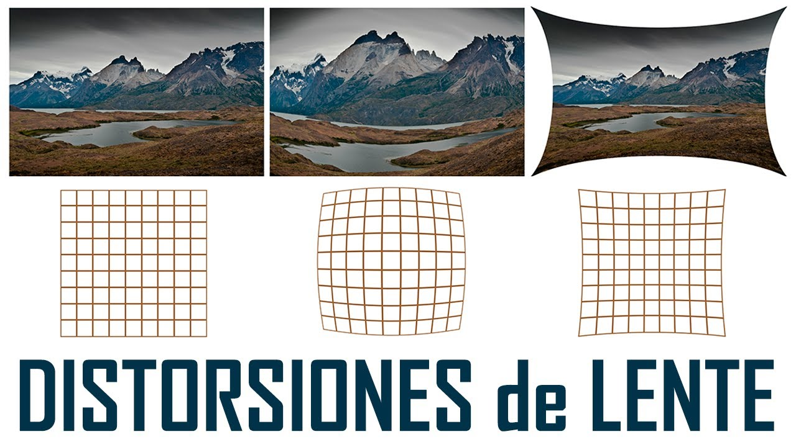

# Visión por Computadora: De Píxeles a Entendimiento 🤖👁️

¡Bienvenidos a este curso de Visión por Computadora\! En este repositorio encontrarás una serie de tutoriales diseñados para llevarte desde los conceptos más básicos hasta técnicas más avanzadas, todo explicado de una manera sencilla y práctica para que cualquiera pueda empezar a "enseñar a ver" a las máquinas.

El objetivo es desmitificar el campo de la CV y darte las herramientas para que puedas crear tus propios proyectos.

-----

## Índice del Curso

1.  **Fundamentos Esenciales**
      * ¿Qué es una imagen para una computadora? (Píxeles, Canales, Resolución)
2.  **Procesamiento de Imágenes**
      * **Calibración de Cámara: Corrigiendo la Visión del Mundo**
      * Operaciones con Píxeles: Brillo, Contraste y Colores
      * Filtros y Convoluciones: Suavizado, Detección de Bordes y Enfoque
3.  **Análisis y Detección**
      * Segmentación de Imágenes: Encontrando lo que nos interesa
      * Detección y Seguimiento de Objetos
4.  **Deep Learning Aplicado a Visión**
      * Introducción a las Redes Neuronales Convolucionales (CNNs)
      * Clasificación de Imágenes
      * Detección de Objetos con Modelos Pre-entrenados (YOLO, SSD)

-----

## Calibración de Cámara: Corrigiendo la Visión del Mundo 📸📏

Empezamos con la calibración porque es un paso fundamental y a menudo subestimado. Antes de poder medir o analizar una escena, debemos asegurarnos de que la cámara nos está dando una imagen geométricamente correcta.

Calibrar una cámara es como **"graduarle la vista"**. Por la forma de sus lentes, las cámaras distorsionan la realidad ver Figura 1. Lo que en el mundo real es una línea recta, en la imagen puede aparecer como una línea ligeramente curva. La calibración nos permite encontrar un modelo matemático para corregir estas imperfecciones.

Antes de poder medir distancias, reconstruir una escena en 3D o interactuar con el mundo, una cámara necesita entender su propia geometría. Calibrar una cámara es el proceso de descubrir sus características internas para traducir los píxeles de una imagen a mediciones fiables del mundo real.

<figure>
  
  <figcaption> Fig.1 Ejemplos de distorsiones del lente. </figcaption>
</figure>

### El Modelo Matemático: Puntos, Píxeles y Matrices

Para corregir las imperfecciones, primero necesitamos un modelo matemático que describa cómo una cámara ideal debería funcionar.

#### El Modelo Pinhole Ideal

El modelo más simple y fundamental es el de la **cámara estenopeica (pinhole)**. Imagina una caja con un pequeño orificio en un lado y una película fotográfica en el lado opuesto. Los rayos de luz de un objeto en el mundo pasan a través del orificio y se proyectan de forma invertida en la película.

Para simplificar las matemáticas, solemos usar un modelo virtual donde el plano de la imagen se coloca *delante* del orificio (que llamamos **centro de proyección**). De esta forma, la imagen no aparece invertida. La relación clave, por semejanza de triángulos, es:

$$x = f \cdot \frac{X}{Z} \quad , \quad y = f \cdot \frac{Y}{Z}$$

Donde:

  * $(X, Y, Z)$ son las coordenadas de un punto 3D en el mundo real.
  * $(x, y)$ son las coordenadas del punto proyectado en el plano de la imagen.
  * $f$ es la **distancia focal** de la cámara. ver figura 2.

<figure>
  
  <figcaption> Fig.2 Q es el punto (X,Y,Z) en el mundo real, q es el punto (x,y) en el plano de la imagen y f es la distancia focal.</figcaption>
</figure>

#### Coordenadas Homogéneas y la Matriz Intrínseca (K)

Podemos expresar esta proyección de forma matricial usando **coordenadas homogéneas**, que añaden una dimensión extra para simplificar las transformaciones proyectivas. Esto nos permite encapsular las propiedades internas de la cámara en una única matriz 3x3 llamada **matriz de parámetros intrínsecos (K)**.

$$\begin{pmatrix} 
x_{pixel} \\
y_{pixel} \\ 
1 \end{pmatrix} = \begin{pmatrix} 
f_x & 0 & c_x \\
0 & f_y & c_y \\ 
0 & 0 & 1 \end{pmatrix} 
\begin{pmatrix} X_{cam} \\
Y_{cam} \\ 
Z_{cam} 
\end{pmatrix}$$

  * **$f\_x, f\_y$ (Distancia Focal en píxeles):** El "zoom" de la lente, pero medido en unidades de píxeles en los ejes X e Y. Es la combinación de la distancia focal física y el tamaño de los píxeles en el sensor.
  * **$c\_x, c\_y$ (Punto Principal):** El verdadero centro óptico de la imagen. Es el punto en píxeles donde el eje óptico de la lente intersecta el sensor. Rara vez coincide con el centro exacto de la imagen.

Antes de continuar vamos a explicar más a detalle que son las coordenadas homogéneas.

Son una maniobra matemática que nos permite simplificar las operaciones geométricas, como las traslaciones, rotaciones y cambios de escala, representándolas todas como una única operación: la multiplicación de matrices.

## ¿Cual es el problema de las coordenadas cartesianas?

En un sistema de coordenadas cartesianas normal (el que usamos habitualmente con ejes X, Y, Z), algunas operaciones geométricas son más complicadas que otras.

* Una **rotación** se puede expresar como una multiplicación de matrices.
* Un **cambio de escala** (escalado) también se puede expresar como una multiplicación de matrices.
* Una **traslación** (mover un objeto sin rotarlo) se expresa como una **suma** de vectores.

Este "problema" de tener que combinar sumas y multiplicaciones es inconveniente para las computadoras, especialmente para el hardware gráfico (GPUs) que está optimizado para realizar multiplicaciones de matrices de forma masiva y muy rápida.

## ¿Cuál es la solución?: Añadir una dimensión extra

Las coordenadas homogéneas resuelven este problema añadiendo una dimensión extra a nuestros puntos, tradicionalmente llamada **w**.

* Un punto **2D** $(X, Y)$ se convierte en $(x, y, w)$.
* Un punto **3D** $(X, Y, Z)$ se convierte en $(x, y, z, w)$.

Para convertir de coordenadas cartesianas a homogéneas, simplemente añadimos un 1 en la nueva coordenada `w`:

* $(X, Y) \rightarrow (X, Y, 1)$
* $(X, Y, Z) \rightarrow (X, Y, Z, 1)$

Para convertir de vuelta de homogéneas a cartesianas, dividimos todas las coordenadas por `w` y descartamos la última componente:

* $(x, y, w) \rightarrow (x/w, y/w)$
* $(x, y, z, w) \rightarrow (x/w, y/w, z/w)$

### ¿Por qué funciona esto?

Al añadir esta dimensión extra, todas las transformaciones geométricas (incluida la traslación) se pueden expresar como una única multiplicación de matrices.

**Ejemplo: Traslación en 2D**

Imagina que quieres mover el punto $(X, Y)$ una distancia de $(T_x, T_y)$.

* **En coordenadas cartesianas:** $(X_{nuevo}, Y_{nuevo}) = (X + T_x, Y + T_y)$ (una suma).
* **En coordenadas homogéneas:** Representamos la traslación con una matriz y el punto como un vector. La operación se convierte en una multiplicación.

$$\begin{pmatrix} 
1 & 0 & T_x \\ 
0 & 1 & T_y \\
0 & 0 & 1 
\end{pmatrix} \begin{pmatrix}
X \\
Y \\
1 
\end{pmatrix} = \begin{pmatrix} 
X + T_x \\
Y + T_y \\
1 
\end{pmatrix}$$

El resultado, $(X + T_x, Y + T_y, 1)$, es el nuevo punto en coordenadas homogéneas. Al convertirlo de vuelta a cartesianas, obtenemos $(X + T_x, Y + T_y)$, que es exactamente el resultado que queríamos.

### El Punto en el Infinito

Una propiedad interesante de las coordenadas homogéneas es que nos permiten representar el concepto de "puntos en el infinito". Si el valor de `w` es 0, al intentar convertir de vuelta a coordenadas cartesianas, tendríamos que dividir por cero.

$$(x, y, 0) \rightarrow (\infty, \infty)$$

Esto es muy útil en gráficos por computadora y visión por computadora para representar la dirección de los rayos de luz o líneas paralelas que "se encuentran" en el infinito.

En resumen, las coordenadas homogéneas son un sistema que, **al añadir una dimensión `w`**, nos permite **unificar todas las transformaciones geométricas en una sola operación de multiplicación de matrices**, lo cual es computacionalmente muy eficiente.

Ahora si continuemos con el proceso de calibración.

#### Parámetros Extrínsecos (R y T)

La matriz intrínseca traduce puntos desde el sistema de coordenadas 3D *de la cámara* a la imagen 2D. Pero, ¿dónde está la cámara en el mundo? Los **parámetros extrínsecos** describen su posición y orientación en el espacio. Consisten en:

  * Una **matriz de rotación (R)** de 3x3 que define la orientación de la cámara.
  * Un **vector de traslación (T)** de 3x1 que define su posición.

Juntos, nos permiten transformar un punto del mundo real $(X\_w, Y\_w, Z\_w)$ al sistema de coordenadas de la cámara $(X\_c, Y\_c, Z\_c)$.

